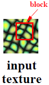
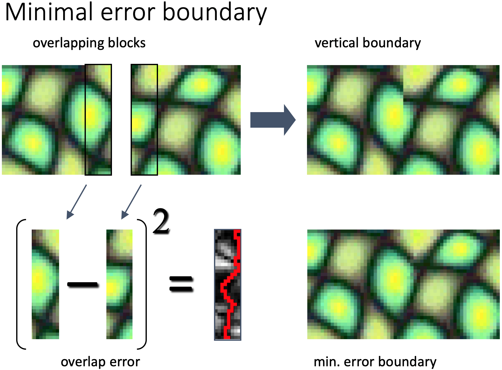
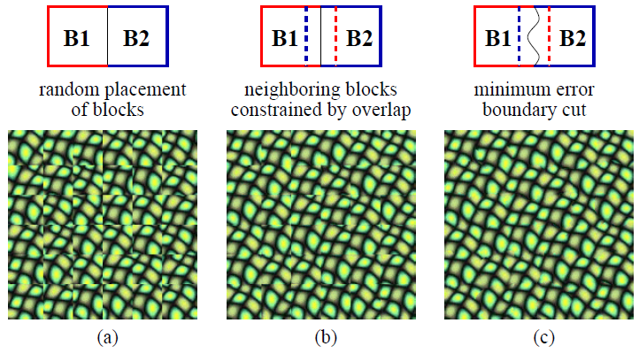

# Image Quilting for Texture Synthesis 

https://www.youtube.com/watch?v=QMiCNJofJUk

Image quilting is a technique for stitching together portions of existing images to create new images.
It has applications of 

1) Texture synthesis is the process of producing big textures from small real-world data.

>The approach works with photos directly and does not require 3D data.

Consult the original work at https://people.eecs.berkeley.edu/efros/research/quilting.html for further information.
All images in this readme are from the original SIGGRAPH '01 paper or presentation.

We'll use Python and NumPy to implement the paper in this repository.

## Texture Synthesis

An input image and a block size are used to start the process:

Then, between the overlap of two blocks, we design a minimum cost path:

Then, by tiling small chunks of the input image, we create a synthesized image.

(a) We basically pick blocks at random here.

(b) Here, we select blocks with the least amount of overlap error.

(c) We follow the same steps as in (c), but we also cut along the minimum error border.

